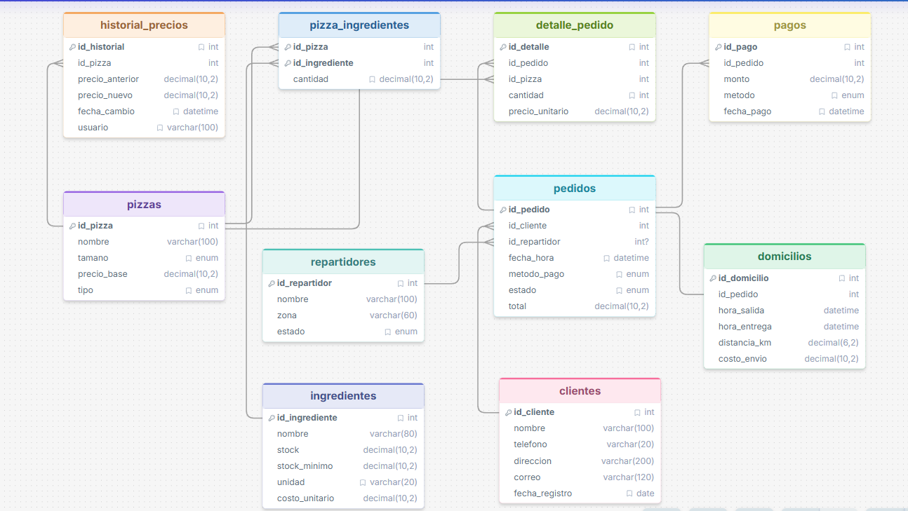
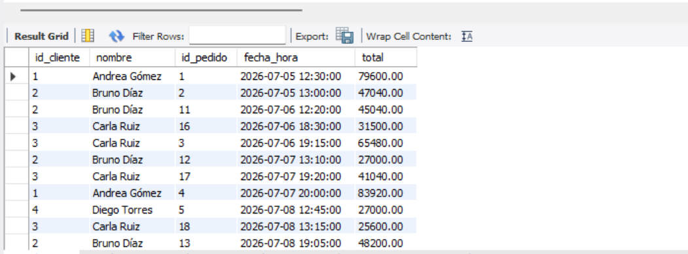
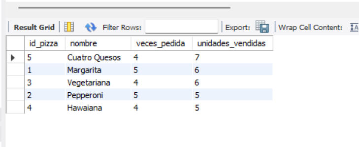
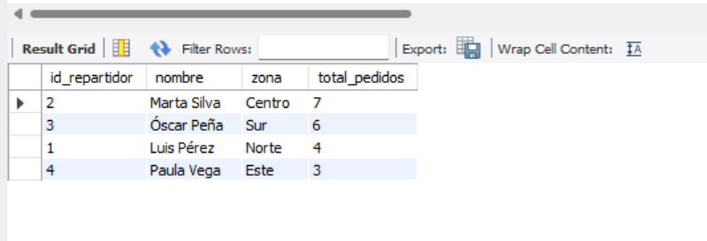
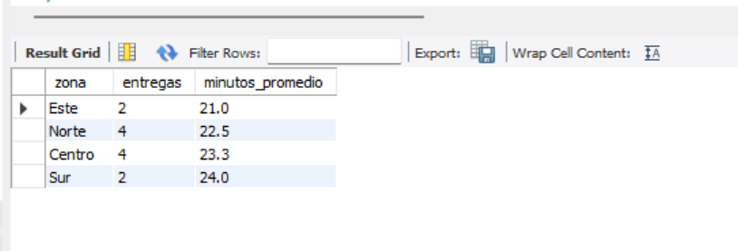
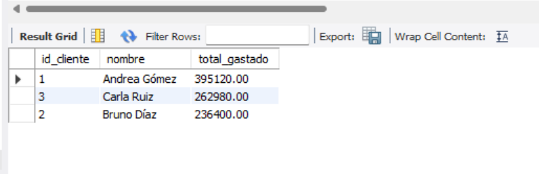
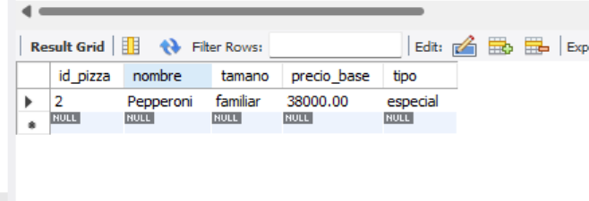
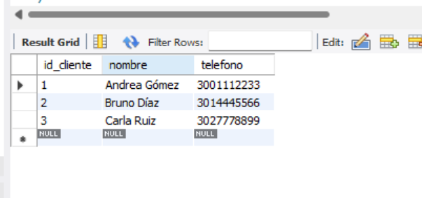

# 🍕 Pizzería Don Piccolo — Sistema de Gestión de Pedidos y Domicilios

Base de datos relacional en **MySQL Workbench** para gestionar todo el proceso de
venta de pizzas y domicilios: clientes, pizzas, ingredientes, pedidos,
repartidores, entregas y pagos. Incluye **funciones, procedimientos, triggers,
vistas y consultas avanzadas** que automatizan y reportan la operación del negocio.

---

## 1. Descripción del proyecto

Pizzería Don Piccolo manejaba sus pedidos de forma manual, lo que producía
retrasos y errores en los registros. Este proyecto implementa una base de datos
que centraliza la información y automatiza tareas clave: registro de clientes e
identificación de clientes frecuentes, catálogo de pizzas con su receta y control
de stock, pedidos con total calculado, asignación de repartidores, gestión de
domicilios y pagos, además de automatizaciones con triggers y reportes con vistas.

---

## 2. Estructura de archivos

```
/pizzeria-don-piccolo/
 ├── database.sql     # CREATE DATABASE, tablas, llaves foráneas y datos de ejemplo
 ├── funciones.sql    # Funciones y procedimiento almacenado
 ├── triggers.sql     # Triggers de stock, auditoría y repartidores
 ├── vistas.sql       # Vistas de reportes
 ├── consultas.sql    # Consultas SQL requeridas (JOIN, subconsultas, agregaciones)
 ├── README.md        # Este documento
 └── imagenes/        # Evidencias (diagrama ER y capturas de las consultas)
```

> **Orden de ejecución obligatorio:**
> `database.sql` → `funciones.sql` → `triggers.sql` → `vistas.sql` → `consultas.sql`

---

## 3. Modelo de datos: tablas y relaciones

El sistema tiene **10 tablas**. El siguiente diagrama entidad-relación muestra su
estructura y las llaves foráneas que las conectan:



| Tabla | Descripción | Relaciones principales |
|-------|-------------|------------------------|
| **clientes** | Datos del cliente (nombre, teléfono, dirección, correo). | 1:N con `pedidos`. |
| **pizzas** | Catálogo (nombre, tamaño, precio base, tipo). | N:M con `ingredientes`; 1:N con `detalle_pedido`. |
| **ingredientes** | Inventario con `stock`, `stock_minimo` y `costo_unitario`. | N:M con `pizzas`. |
| **pizza_ingredientes** | Receta: cantidad de cada ingrediente por pizza. | FK a `pizzas` y a `ingredientes`. |
| **repartidores** | Nombre, zona y estado (disponible / no_disponible). | 1:N con `pedidos`. |
| **pedidos** | Encabezado del pedido (cliente, fecha, método de pago, estado, total). | FK a `clientes` y `repartidores`; 1:N con `detalle_pedido`; 1:1 con `domicilios`; 1:N con `pagos`. |
| **detalle_pedido** | Líneas del pedido: pizza, cantidad y precio unitario. | FK a `pedidos` y `pizzas`. |
| **domicilios** | Logística de entrega (salida, entrega, distancia, costo). | 1:1 con `pedidos`. |
| **pagos** | Pago asociado a un pedido. | FK a `pedidos`. |
| **historial_precios** | Auditoría de cambios de precio de pizzas (la llena un trigger). | FK a `pizzas`. |

### Relaciones clave
- Un **cliente** hace muchos **pedidos** (1:N).
- Un **pedido** contiene muchas **pizzas** a través de `detalle_pedido` (N:M).
- Una **pizza** se compone de muchos **ingredientes** a través de `pizza_ingredientes` (N:M).
- Un **pedido** tiene un solo **domicilio** (1:1) y puede tener uno o varios **pagos** (1:N).
- Un **repartidor** atiende muchos **pedidos** (1:N).

---

## 4. Funciones, procedimientos y triggers

**Funciones**
- `fn_total_pedido(id_pedido)` → total = Σ(precio × cantidad) + envío + IVA (8 %).
- `fn_ganancia_neta_diaria(fecha)` → ventas del día − costo de ingredientes.

**Procedimiento**
- `sp_registrar_entrega(id_pedido, hora_entrega)` → registra la entrega y cambia el estado del pedido a `entregado`.

**Triggers**
- `trg_actualizar_stock` — descuenta ingredientes al vender.
- `trg_historial_precios` — audita cambios de precio de pizzas.
- `trg_repartidor_disponible` — libera al repartidor al registrar la entrega.
- `trg_repartidor_ocupado` *(apoyo)* — ocupa al repartidor al salir el domicilio.

---

## 5. Consultas incluidas y evidencias

A continuación las 7 consultas requeridas con su evidencia de ejecución:

### 5.1. Clientes con pedidos entre dos fechas — `BETWEEN`


### 5.2. Pizzas más vendidas — `GROUP BY` + `COUNT` / `SUM`


### 5.3. Pedidos por repartidor — `JOIN`


### 5.4. Promedio de tiempo de entrega por zona — `AVG` + `JOIN`


### 5.5. Clientes que gastaron más de un monto — `HAVING`


### 5.6. Búsqueda parcial por nombre de pizza — `LIKE`


### 5.7. Clientes frecuentes (> 5 pedidos mensuales) — `SUBCONSULTA`


---

## 6. Vistas (`vistas.sql`)
- `vista_resumen_pedidos_cliente` — nombre del cliente, cantidad de pedidos y total gastado.
- `vista_desempeno_repartidores` — número de entregas, tiempo promedio y zona.
- `vista_stock_bajo` — ingredientes cuyo stock está por debajo del mínimo.

---

## 7. Instrucciones para ejecutar el script

**Opción A — Consola / Workbench (SOURCE):**

```sql
SOURCE ruta/al/proyecto/database.sql;
SOURCE ruta/al/proyecto/funciones.sql;
SOURCE ruta/al/proyecto/triggers.sql;
SOURCE ruta/al/proyecto/vistas.sql;
SOURCE ruta/al/proyecto/consultas.sql;
```

**Opción B — Terminal:**

```bash
mysql -u root -p < database.sql
mysql -u root -p < funciones.sql
mysql -u root -p < triggers.sql
mysql -u root -p < vistas.sql
mysql -u root -p pizzeria_don_piccolo < consultas.sql
```

**Opción C — MySQL Workbench:** abrir cada archivo (**File → Open SQL Script**) y
ejecutarlo con el rayo ⚡ en el mismo orden.

> **Requisitos:** MySQL  El script recrea la base de datos
> desde cero (incluye `DROP DATABASE IF EXISTS`), por lo que se puede volver a
> ejecutar sin conflictos. `funciones.sql` incluye `SET SQL_SAFE_UPDATES = 0;`
> para evitar el Error 1175 en Workbench.


---

**Autor:** vladimir acelas · Proyecto Pizzería Don Piccolo
